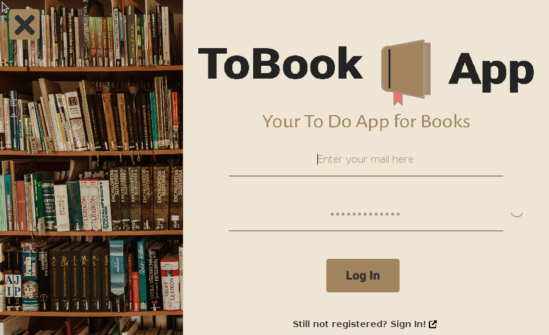
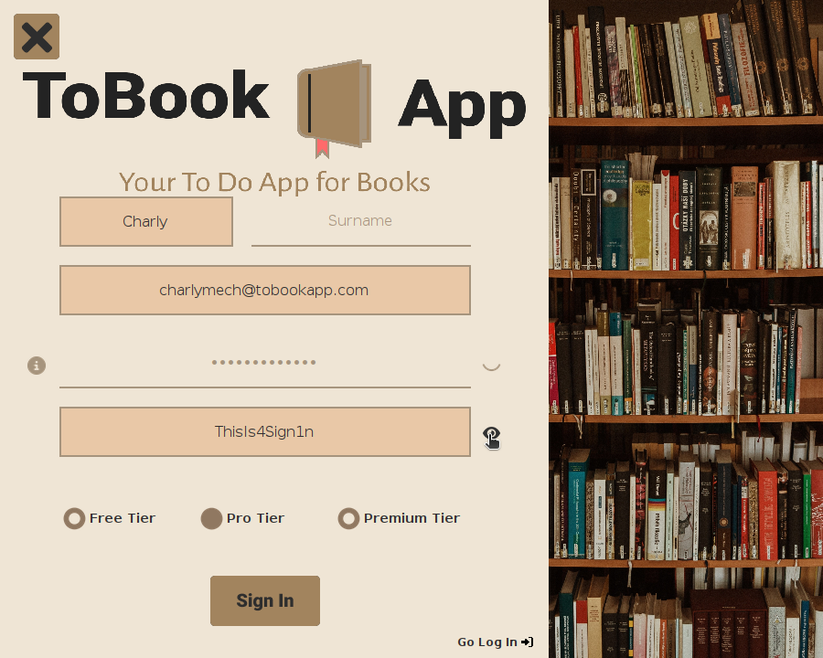
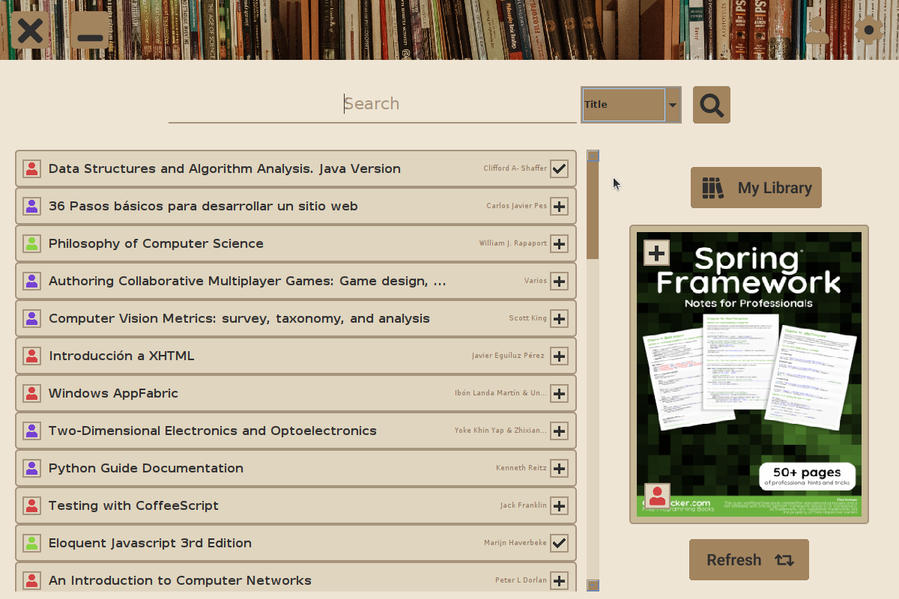
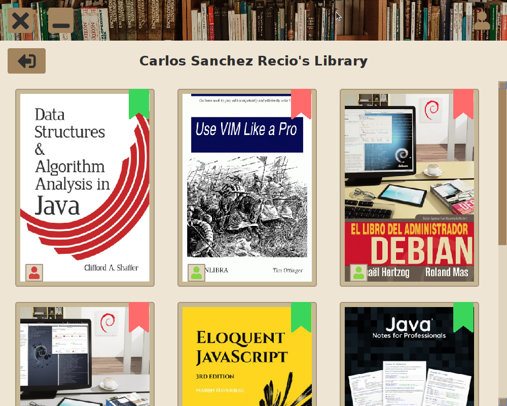
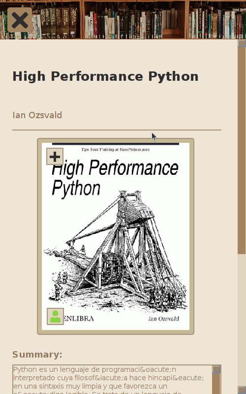
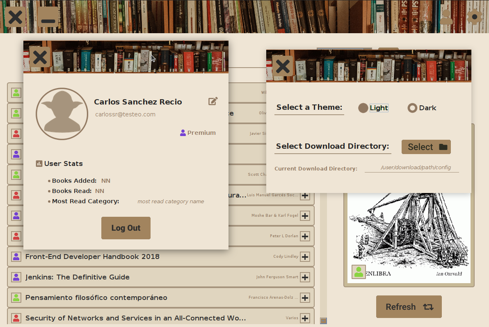

# ToBook App - DAM Project

ToBook App is your classic To-Do app but for books. Developed in Java with custom Swing interface.

## :books: ToBook App v.2023

ToBook App version on June 2023 (DAM 3rd term project presentation).

### :computer: Tech Stack

###### Java - Java Swing


Version:

```java
	Runtime.Version version = Runtime.version();
    System.out.println(version);
	 // OUTPUT: 11.0.19+7-post-Ubuntu-0ubuntu122.04.1
```

###### Database Manager and Service

MySQL Server service on [Ubuntu 22.04](https://releases.ubuntu.com/jammy/) server executed in [VirtualBox](https://www.virtualbox.org/) virtual Machine.

<h3 style="
			  display: flex;
			  justify-content:center;
			  align-items:center;
">


</h3>

[DataBase Designs](documentation/DataBase/README.md)

### :camera: ScreenShots

###### Log In



###### Sign In



###### Library - main window



###### User's Library



###### Book



###### User Info & Settings



[GUI designs](documentation/WindowsDesigns/README.md) designed with Figma 

### :red_circle: Current application limitations

-  Books available: 70 -> Future implementation for more books (see [get_books repository](https://github.com/CharlyMech/get_books_PDFLibrary))
-  Topics: centered around programming and system (also some science and philosophy)
-  Subscriptions: currently not implemented
-  Mail: no mail valiadation server yet
-  Dark/Light theme, download directory: no file reading/writing implementation
-  Download file: [OpenLibra](https://openlibra.com/) does not allow to autodownload (tried with scraping script) so no files can be downloaded.
-  Read PDF Files: since no files have been downloaded automatically, no pdf file reader has been implemented now.

## :arrows_clockwise: Pendent work to-do & upgrades

-  [ ] Window abstraction
-  [ ] Data insertion (full)
-  [ ] Window drag offset bug
-  [ ] Book add while Library & Book windows are opened (update simultaneously)
-  [ ] Multi-threading: execution is slow now
-  [ ] Keyboard tabulation through JTextFields
-  [ ] Mouse listener to reset style in JTextFiels if they are empy/default if user click outside them
