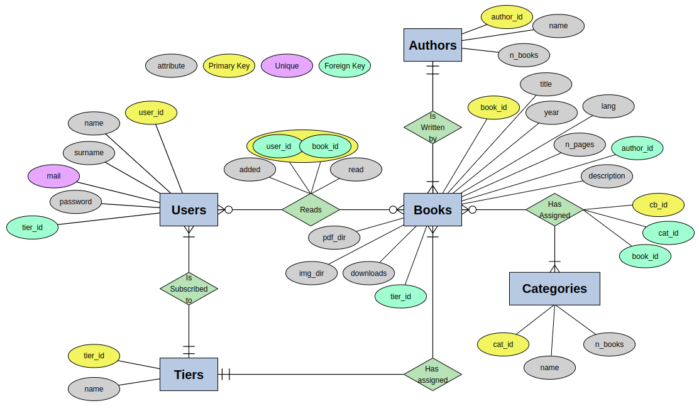

# DataBase

<h3 style="
			  display: flex;
			  justify-content:center;
			  align-items:center;
">


</div>

Version:

```bash
	$ mysql --version
	# OUTPUT: mysql  Ver 8.0.33-0ubuntu0.22.04.2 for Linux on x86_64 ((Ubuntu))
```

## ER-Diagram

File: [yEd](yEd_files/ER-Diagram%20PDF%20Library.graphml)



## Relational Model

File: [yEd](yEd_files/PDF%20Library%20Relational%20Model.graphml)


