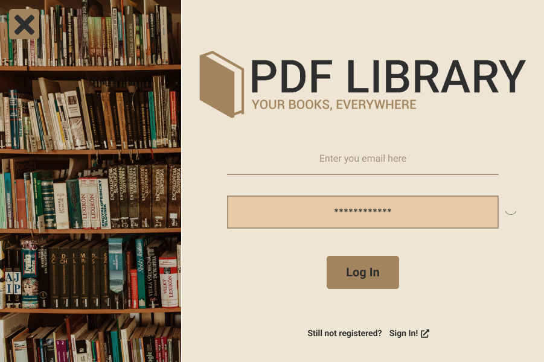
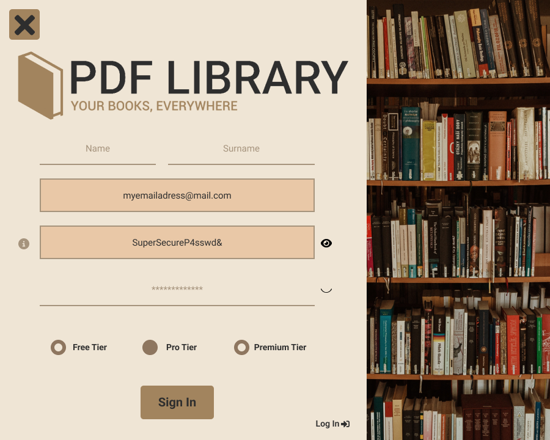
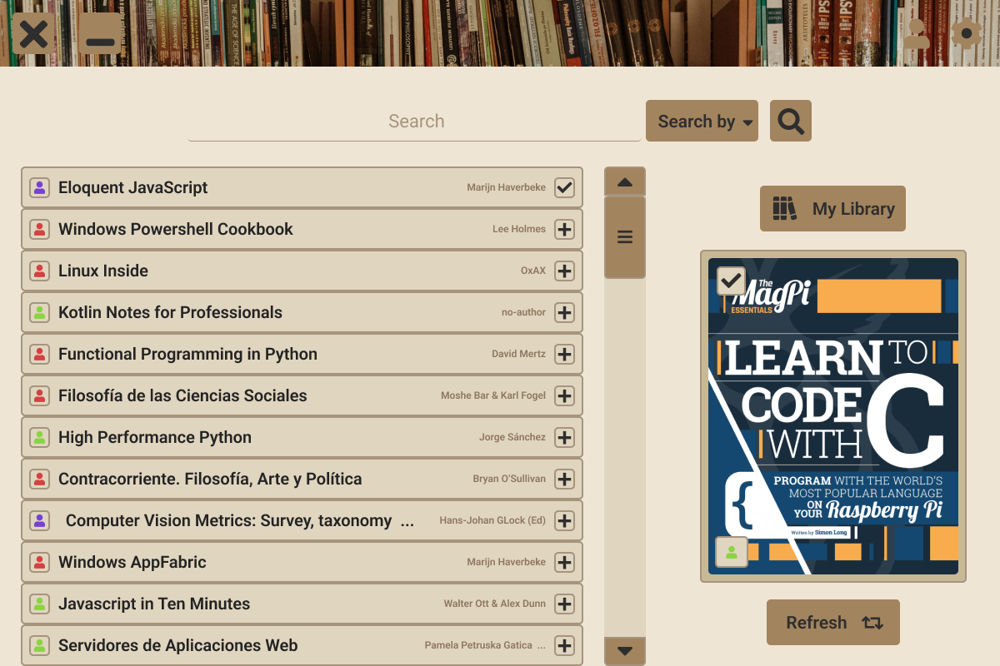
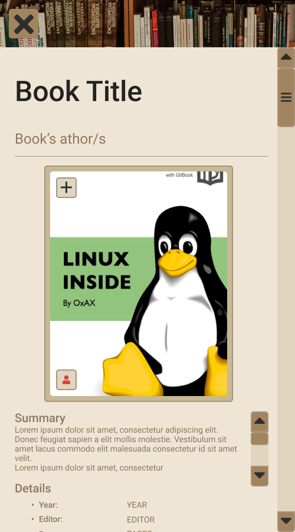
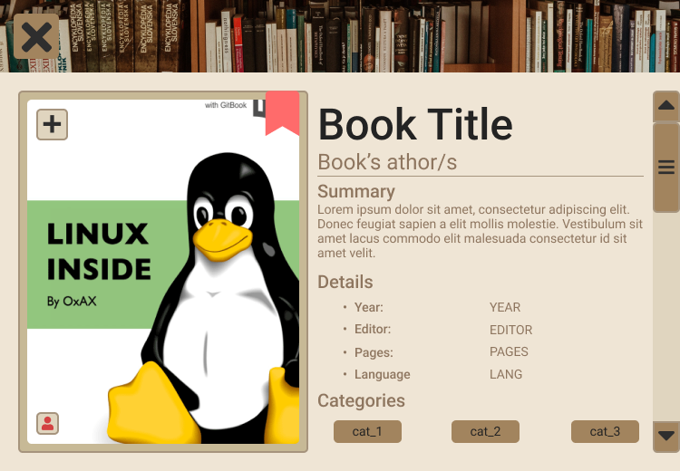
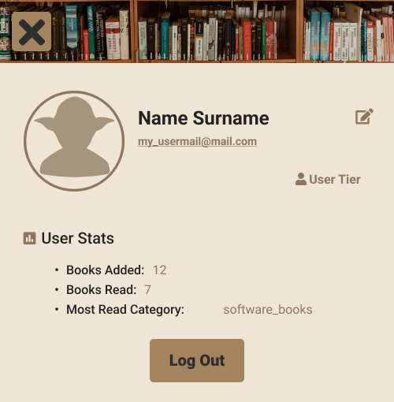
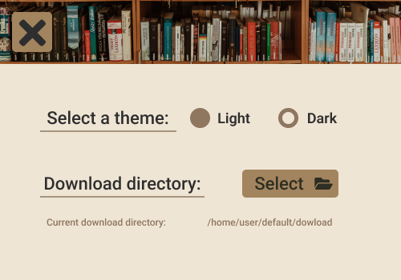
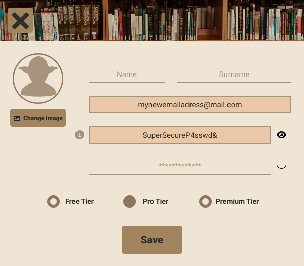

# GUI Designs

All designs have been made with [Figma](https://www.figma.com/).

<h3 style="
			  display: flex;
			  justify-content:center;
			  align-items:center;
">

# Designs

### Log In

### Sign In

### Library - Main Window

### Book

#### Final Book Window Design

#### Old Book Window Design

### User's Library

### Settings

### User Info

### Edit User Info

## Note

As you can see, the final result is pretty close to the one designed on Figma, although the logo has changed. The main reason why I changed it is because I could auto-download the files so I decided to modify the app concept and be kind a To-Do app for books. 
