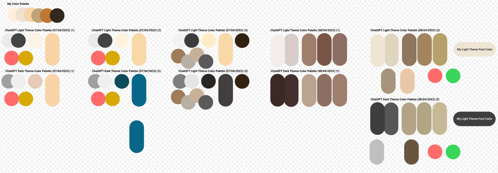

# ChatGPT questions for project

### Color Palette

For the final color palette, I asked ChatGPT for a browned-based color palette. I also asked for different accent colors and a dark theme, but this one I did not implement.

[Chat](ColorPalette/chatgpt_ColorPalette_questions.txt)

### Search Engine

I've never tryed to code a search engine and I wanted some advices, so I asked ChatGPT how to develop my own. It finally came with something similar to what I thought it would be like.

[Chat](SearchEngine/chatGPT_SearchEngine_questions.txt)
